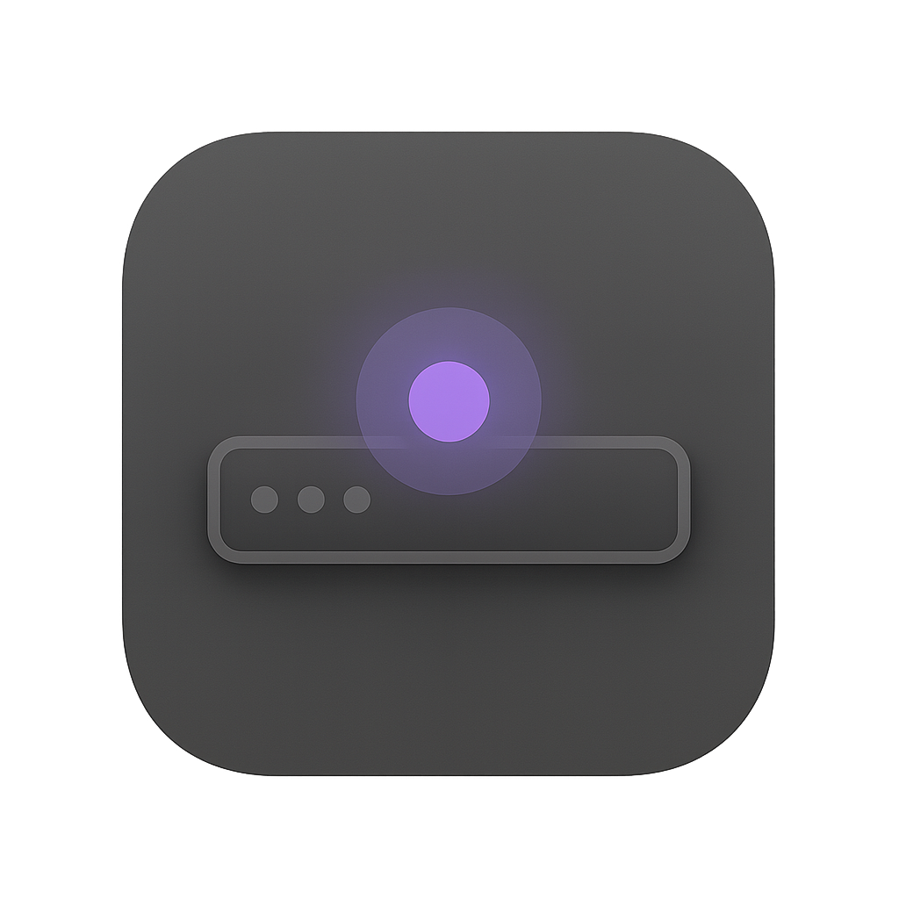
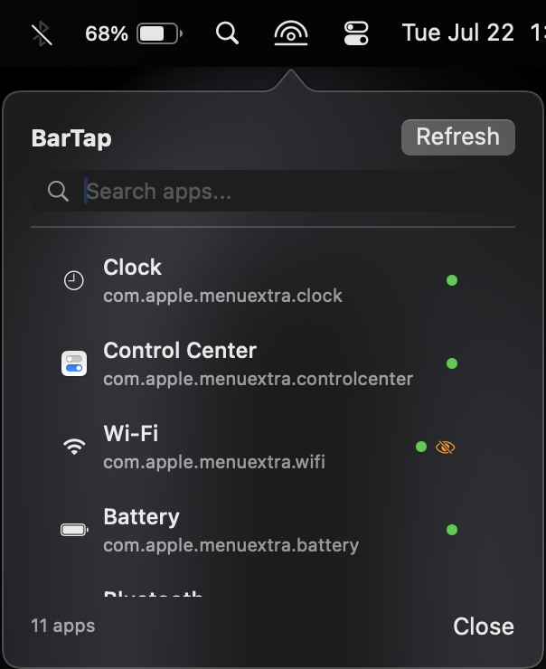
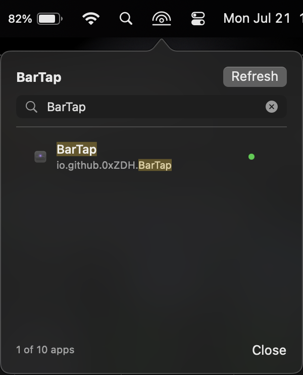

    </img>
    <h1>BarTap</h1>

**BarTap** is a minimal MacOS utility solely meant to provide access to menu bar applications during scenarios where the camera notch obscures them.

While multiple applications already exist that solve this problem, **BarTap** is designed to be incredibly lightweight and minimal in its permission requirements.

    </img>
    &nbsp;&nbsp;&nbsp;
    </img>

    <h2>Usage</h2>

1. On the first run of **BarTap**, all current applications in the menu bar will be cataloged and presented in the popover view.
2. From here, a user can do several actions:
    1. Left-click the application name to simulate clicking the applications menu bar icon.
    2. When hovering over an application, a 'stop application' button will appear on the right. If clicked, this will stop the applications process.
    3. Right-click the application to display a context menu with three options: Click Menu Bar, Open Application, Close Application.
3. If any new running applications are not present in the menu, click the 'Refresh' button at the top right.

    <h2>Building, Installing, and Signing</h2>

    <h4>Building BarTap from the source</h4>

1. Open the project file (`xcodeproj`) in XCode
2. Go to Product > Archive
3. Select 'Distribute App' > 'Custom' > 'Copy App'
4. Save the app to your local system

    <h4>Signing BarTap</h4>

1. Go to the Keychain Access app on your Mac.
2. Choose Keychain Access > Certificate Assistant > Create a Certificate.
3. Specify the following details:
    1. Name: `BarTapDev`
    2. Identity Type: `Self Signed Root`
    3. Certificate Type: `Code Signing`
4. Now that the certificate is created, you need to trust it
    1. Right-click the 'certificate' in Keychain Access
    2. Select 'Get Info' and expand the 'Trust' dropdown
    3. Set 'When using this certificate' to 'Always Trust'
    4. Exit the modal to save the settings
5. Now the certificate exists and is trusted for code signing, sign the application
  - `codesign --deep --force --sign "BarTapDev" BarTap.app`

> When you launch BarTap for the first time, a permissions prompt will trigger to allow BarTap access to Accessibility.

    <h4>Running BarTap</h4>

1. Run the **BarTap** application
    1. On the first run, you will see a security pop-up - navigate to 'System settings' > 'Privacy & Security' > Scroll down to 'BarTap' and allow it to run.
2. Run **BarTap** again and you will see a permissions request pop-up requesting access to Accessibility features - allow this.
3. Finally, run **BarTap** again and it should run normally.

    <h2>TODO</h2>

- [x] Implement visual status indicators for apps hidden/obscured by the camera notch or menu bar overflow conditions
- [ ] Cache the application list to improve popover speed and reduce CPU usage
- [ ] Cache application icons to disk to reduce memory consumption
