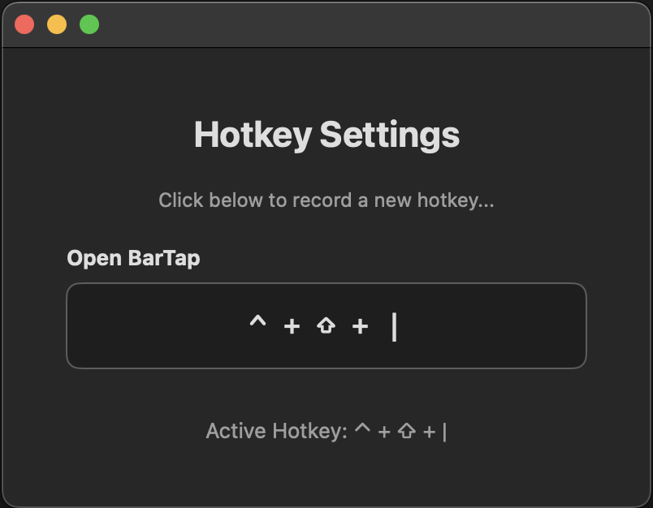
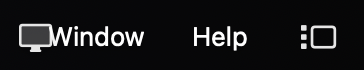

<div align="center">
    </img>
    <h1>BarTap</h1>
</div>

**BarTap** is a minimal macOS utility to access menu bar items that have been hidden or obscured.

While other applications exist that solve this problem, **BarTap** is designed to be lightweight, fast, and require minimal permissions.

<div align="center">
    </img>
    &nbsp;&nbsp;&nbsp;
    </img>
</div>


<div align="center">
    <h2>Installation</h2>
</div>

<div align="center">
    <h4>Pre-built releases</h4>
</div>

1. Navigate to the [releases page](https://github.com/0xZDH/BarTap/releases)
2. Expand 'assets' under the version you want and download `BarTap.app.zip`
3. Once downloaded, unzip `BarTap.app.zip`
4. Sign `BarTap.app` (see 'Signing BarTap' below)
5. Make BarTap executable (`chmod +x BarTap.app/Contents/MacOS/BarTap`)

The GitHub workflow uses two external action images:

- maxim-lobanov/setup-xcode@v1
- softprops/action-gh-release@v1

<div align="center">
    <h4>Building the app from source</h4>
</div>

If you prefer to build **BarTap** yourself, follow these steps:

**Prerequisites:**
*   Xcode

**1. Build BarTap**
1.  Open the `BarTap.xcodeproj` file in Xcode.
2.  Go to **Product** > **Archive**.
3.  In the Archives window, select **Distribute App** > **Custom** > **Copy App**.
4.  Save `BarTap.app` to your system.

<div align="center">
    <h4>Signing the app</h4>
</div>

> As this is a personal project, official **BarTap** releases are not signed with an Apple Developer ID to avoid developer program costs. You can sign it locally with a self-signed certificate.

1.  Open the **Keychain Access** app.
2.  Go to **Keychain Access** > **Certificate Assistant** > **Create a Certificate...**.
3.  Use the following settings:
    *   **Name:** `BarTapCert`
    *   **Identity Type:** `Self Signed Root`
    *   **Certificate Type:** `Code Signing`
4.  After the certificate is created, trust the new certificate:
    *   Right-click the certificate in Keychain Access and select **Get Info**.
    *   Expand the **Trust** section.
    *   Set **When using this certificate** to **Always Trust**.
5.  Sign the application using the following command:
    ```sh
    codesign --deep --force --sign "BarTapCert" /path/to/BarTap.app
    ```

<div align="center">
    <h4>Running the app for the first time</h4>
</div>

When you run **BarTap** for the first time, macOS will ask for permissions.

1.  **Allow the app to run:** The first time you open **BarTap**, a security pop-up will appear. Go to **System Settings** > **Privacy & Security**, scroll down, and allow **BarTap** to run.
2.  **Grant Accessibility permissions:** Run **BarTap** again. A prompt will ask for Accessibility access. This is required for **BarTap** to interact with other menu bar apps - allow it.

<div align="center">
    <h2>Usage</h2>
</div>

1.  On launch, **BarTap** will catalog all applications currently in your menu bar.
2.  You can perform several actions:
    *   **Left-click** an application to simulate a click on its menu bar icon.
    *   **Hover** over an application to reveal a button to quit that application.
    *   **Right-click** an application for a context menu with more options.
3.  Click the **Refresh** button to find any new menu bar apps started after **BarTap** was launched (*this is a manual fallback as new apps are detected automatically by **BarTap***).

**BarTap** allows the user to register a global hotkey to toggle the popover view. By default, the hotkey is configured as `ctrl + shift + |`. Use the Hotkey Settings window to configure a custom hotkey.

<div align="center">
    </img>
</div>


<div align="center">
    <h2>Under the Hood</h2>
</div>

1. Background Monitoring
    *   **NSWorkspace KVO**: Capture app launch/termination events by observing the `runningApplications` key path
    *   **Per-PID DispatchSource Watchers**: Provide immediate process exit notifications by attaching `DispatchSource.makeProcessSource` to observed PIDs

> **BarTap** originally observed the workspace for the *didLaunchApplicationNotification* and *didTerminateApplicationNotification* events, but these failed to capture events associated with `.accessory` applications.

2. Icon Caching
    *   **Two-tier caching**: In-memory (NSCache) + on-disk cache
    *   **Bounded memory usage**: 256 items, ~1MB limit
    *   **Icon optimization**: Resize to 32x32 and convert to PNG
    *   **Staleness detection**: Compare app modification dates to update cached icons


<div align="center">
    <h2>Known Issues</h2>
</div>

1. **Icon overlap**: When applications in the menu bar reach the Mac laptop camera notch, the first 'hidden' app is still within the visible frame, but just 'hidden'. As a result, if this application is clicked through **BarTap** it is forced forward which ends up causing overlaps if the focused application menu (File, Edit, Window, etc.) extend to where the icon exists.

<div align="center">
    </img>
</div>

> *A temporary fix for this is, once the user has completed using the applications menu, to move the icon back behind the camera notch (using command + left-click to drag the icon)*


<div align="center">
    <h2>Contributing</h2>
</div>

Contributions are more than welcome! Feel free to open an issue for bug reports or feature requests.


<div align="center">
    <h2>License</h2>
</div>

This project is licensed under the MIT License. See the [LICENSE](LICENSE) file for details.
